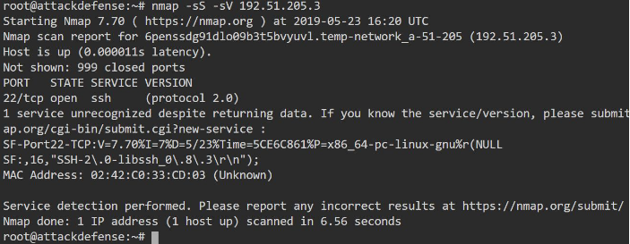

# SSH

- port: 22
- nmap -sS -sV 
- `nc <ip> 22` : banner grabbing



## Metasploit module:

- auxiliary/scanner/ssh/libssh_auth_bypass (libssh 0.8.3 is vuln - see SS above - we detected the version using nmap)
	- set SPAWN_PTY true