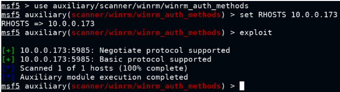

# winrm

- port:5985 (not scanned in default nmap scan)
- `nmap --top-ports 7000 <ip>` 
- metasploit modules
	- auxiliary/scanner/winrm/winrm_login : brute force
	- IMPORTANT: use auxiliary/scanner/winrm/winrm_auth_methods
		- need to use a valid auth method while connecting to service
		- https://docs.microsoft.com/en-us/windows/win32/winrm/authentication-for-remote-connections
		
		
		
	- auxiliary/scanner/winrm/winrm_cmd : execute cmd on target server as legit user - needs creds
	- exploit/windows/winrm/winrm_script_exec: interactive meterpreter session
		- set FORCE_VBS true
	- exploit/windows/winrm/winrm_script_exec
		- needs legit creds to exploit
		- set force_vbs true

# Wordlists

- /usr/share/metasploit-framework/data/wordlists/common_users.txt
- /usr/share/metasploit-framework/data/wordlists/unix_passwords.txt