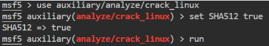

# Metasploit Modules:

- auxiliary/analyze/crack_linux (uses creds in msf db "loot")
	- set SHA512 true
- post/linux/gather/hashdump

	  
# johntheripper

- `john --list=formats`
- `john --format=sha512crypt <hash_file> --wordlist=<wordlist_path>`
	
# hashcat

- -m specifies hash_type. eg. 1000=ntlm
- -a specifies attack_mode. eg 3=brute-force
- `hashcat -m 1800 -a3 <hash_file> <wordlist>`