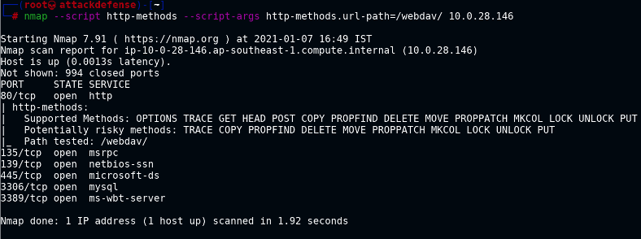

# Initial enum

- `whatweb <ip>` : get tech stack and versions
- `http <ip>` : get target server info
- `browsh --startup-url <url>`
- `curl <url>`
- `wget <url>`
- lynx <url>

# Direcory enumeration

- dirb <url> <wordlist>
	
# Nmap scripts

- http-enum : discover interesting dirs like webdav - check Host-based attacks > Windows > webdav
- http-headers : server header info
- http-methods --script-args http-methods.url-path=/webdav/ : allowed methods

- http-webdav-scan --script-args http-methods.url-path=/webdav/ : Running webdav scan Nmap script to identify WebDAV installations the script uses the OPTIONS and PROPFIND methods to detect it.
- banner
- http-shellshock --script-args “http-shellshock.uri=/gettime.cgi"

# Metasploit Modules

- auxiliary/scanner/http/http_version
- auxiliary/scanner/http/brute_dirs
- auxiliary/scanner/http/robots_txt
- auxiliary/scanner/http/apache_userdir_enum
- auxiliary/scanner/http/brute_dirs
- auxiliary/scanner/http/dir_scanner
- auxiliary/scanner/http/dir_listing
- auxiliary/scanner/http/http_put
- auxiliary/scanner/http/files_dir
- auxiliary/scanner/http/http_login
- auxiliary/scanner/http/http_header
- exploit/windows/http/badblue_passthru

- searchsploit badblue 2.7

# References

1. [Httpie](https://httpie.io/)
2. [WhatWeb](https://github.com/urbanadventurer/WhatWeb)
3. [Browsh](https://github.com/browsh-org/browsh)