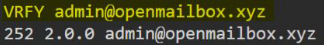
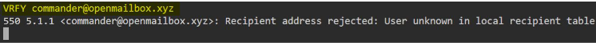
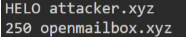
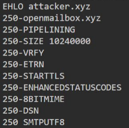

# SMTP

- port 25
- nmap -sV -script banner 192.80.153.3
- nc <ip> 25
	- VRFY admin@openmailbox.xyz

	
	
	  
- `telnet <ip> 25`
	- `HELO attacker.xyz`

	

	- `EHLO attacker.xyz`
	
	
	  
- send fake mail using telnet:
	- `HELO attacker.xyz`
	- `mail from: admin@attacker.xyz`
	- `rcpt to:root@openmailbox.xyz` 
	``` 
	  data
	  Subject: Hi Root
	  Hello,
	  This is a fake mail sent using telnet command.
	  From,
	  Admin
	  . (dot)
	```

- smtp-user-enum -U <userlist> -t 192.80.153.3
- sendemail -f admin@attacker.xyz -t root@openmailbox.xyz -s 192.26.29.3 -u Fakemail -m "Hi root, a fake from admin" -o tls=no

# Metasploit Module

- auxiliary/scanner/smtp/smtp_enum

# Wordlists

- /usr/share/commix/src/txt/usernames.txt