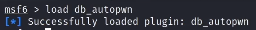
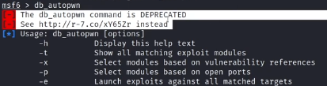
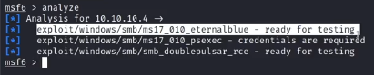

# Vulnerability Scanning

## db_autopwn

- https://github.com/hahwul/metasploit-autopwn : plugin to auto detect vulns
- works if services and hosts are there in msf db

- db_autopwn -p -t -PI 445
- analyze

## wmap plugin

- load wmap
- wmap_sites -a 192.157.89.3 : add site
- wmap_targets -t http://192.157.89.3 : add target ip address
- wmap_sites -l
- wmap_targets -l
- wmap_run -t : display list of available modules that can be run
- wmap_run -e : run enabled modules