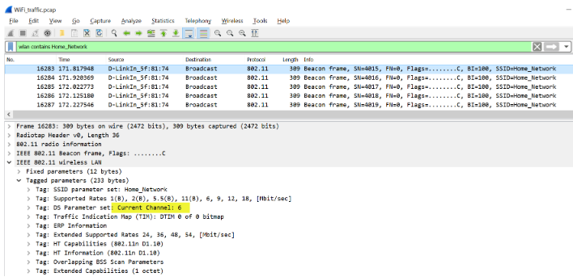
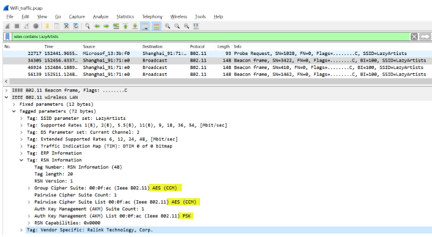
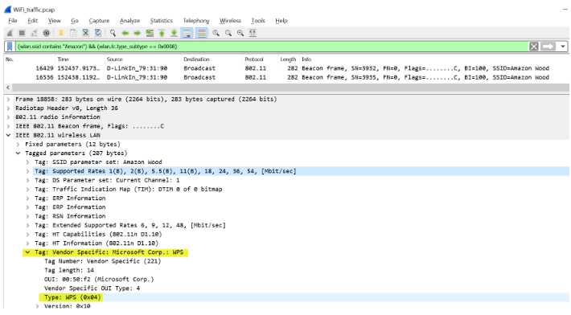
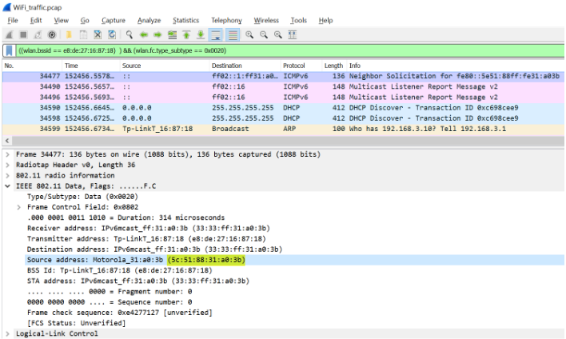

# Tshark

- D : supported network interfaces
- i <interface> : specify interface to sniff traffic on
	- `tshark -i eth0`
- r <pcap file> : read a pcap file
	- `tshark -r HTTP_traffic.pcap` 
- c : number of packets to read from a pcap file
	- `tshark -r HTTP_traffic.pcap -c 100`
- z : print the list of protocols
	- `tshark -r HTTP_traffic.pcap -z io,phs –q`
- Y <filter> : apply diplay filter
	- `tshark -Y ‘http’ -r HTTP_traffic.pcap`
	- `tshark -r HTTP_traffic.pcap -Y "ip.src==192.168.252.128 && ip.dst==52.32.74.91"`
	- `tshark -r HTTP_traffic.pcap -Y "http.request.method==GET"`
	- `tshark -r HTTP_traffic.pcap -Y "http contains password”` : http packets which contain the string "password"
- Tfields -e <field> : show onlly specified fields
	- `tshark -r HTTP_traffic.pcap -Y "http.request.method==GET" -Tfields -e frame.time -e ip.src -e http.request.full_uri`
	- `tshark -r HTTP_traffic.pcap -Y "http.request.method==GET && http.host==www.nytimes.com" -Tfields -e ip.dst`
	- `tshark -r HTTP_traffic.pcap -Y "ip contains amazon.in && ip.src==192.168.252.128" -Tfields -e ip.src -e http.cookie` : session id being used by a particular ip for a specific website
	- `tshark -r HTTP_traffic.pcap -Y "ip.src==192.168.252.128 && http" -Tfields -e http.user_agent` : get os of machine

# Wireshark Filters for Wifi:

- wifi with open security:
  `(wlan.fc.type_subtype == 0x0008) && (!(wlan.wfa.ie.wpa.version == 1)) && !(wlan.tag.number == 48)`
- operating channel for an ssid
  `wlan contains Home_Network`

  

- security mechanism configured for an ssid
  `wlan contains LazyArtists`

  

- if WPS is enabled on an SSID
  `(wlan.ssid contains "Amazon") && (wlan.fc.type_subtype == 0x0008)`

  
  
- packets transmitted or received by a device with a mac address
  `(wlan.ta == e8:de:27:16:87:18) || (wlan.ra == e8:de:27:16:87:18)`
- mac addr of station which exchanged packets with a given SSID
  `(wlan.bssid == e8:de:27:16:87:18) && (wlan.fc.type_subtype == 0x0020)`
  
  
    
	

# Tshark for wifi traffic:

- to show only wifi traffic
  `tshark -r WiFi_traffic.pcap -Y "wlan"`
- to show deauth packets
  `tshark -r WiFi_traffic.pcap -Y "wlan.fc.type_subtype==0x000c"`
- to show wpa handshake packets
  `tshark -r WiFi_traffic.pcap -Y "eapol"`
- to show ssid and bssid values for all beacon frames
  `tshark -r WiFi_traffic.pcap -Y "wlan.fc.type_subtype==8" -Tfields -e wlan.ssid -e wlan.bssid`
- bssid for a given ssid
  `tshark -r WiFi_traffic.pcap -Y "wlan.ssid==LazyArtists" -Tfields -e wlan.bssid`
- operating channel for an ssid
  `tshark -r WiFi_traffic.pcap -Y "wlan.ssid==Home_Network" -Tfields -e wlan_radio.channel | uniq`
- devices which received deauth packets
  `tshark -r WiFi_traffic.pcap -Y "wlan.fc.type_subtype==0x000c" -Tfields -e wlan.ra`
- manufacturer for a given mac address
  `tshark -r WiFi_traffic.pcap -Y "wlan.ta==5c:51:88:31:a0:3b && http" -Tfields -e http.user_agent`

# Arp Spoofing

- `echo 1 > /proc/sys/net/ipv4/ip_forward` : on client machine
- `arpspoof -i eth1 -t 10.100.13.37 -r 10.100.13.36`
- capture wireshark traffic on eth1 interface
- if client is telnet-ing, we will capture password