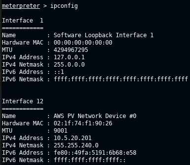
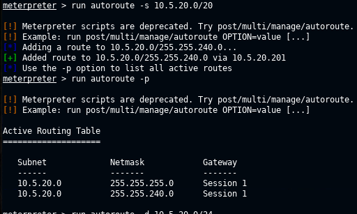
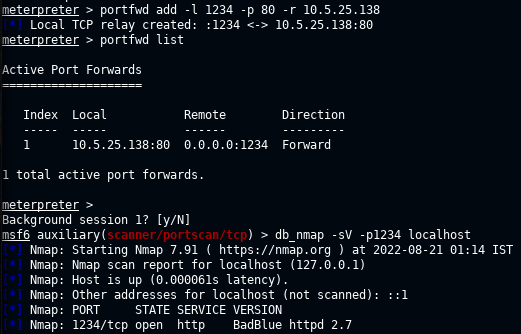
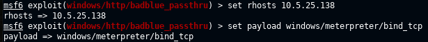
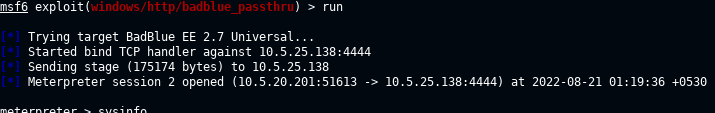
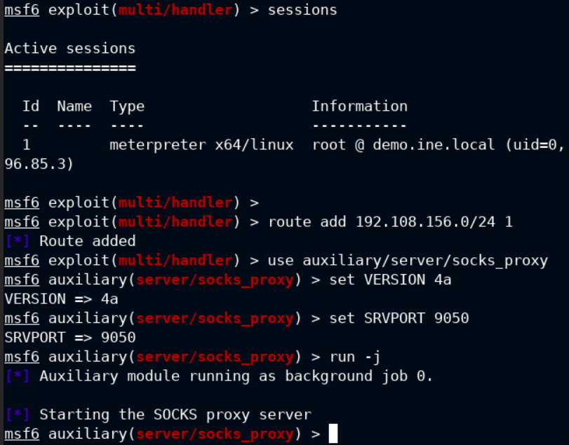
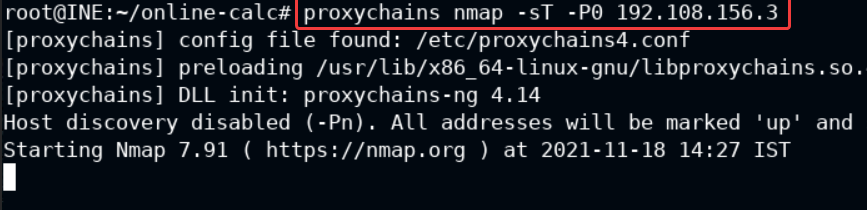
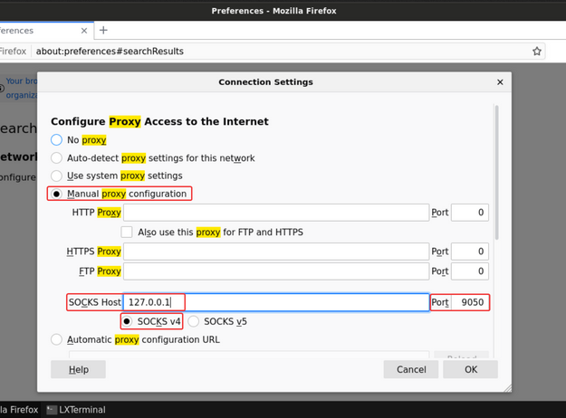
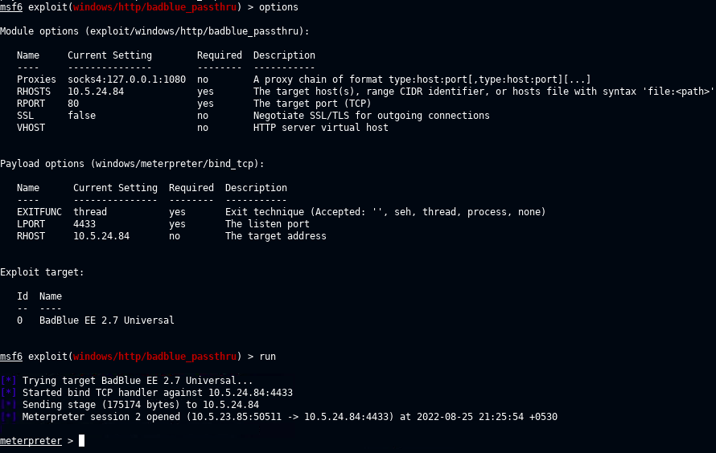

# Pivoting

## Port Forwarding

- redirecting traffic from port on target_sys_2 to local_port of attacker_sys

## Meterpreter Commands

- ipconfig : find subnet that target_sys_1 is a part of

  
- run autoroute -s <subnet> : adds routes
- run autoroute -p : displays active routing table

  
- run a tcp portscan on remotehost usong msf module. forward remote port to local port and run nmap scan on local port.
- portfwd add -l 1234 -p 80 -r <target_sys_2_ip>
- portfwd list

  

- use msf module portscan/tcp to scan victim 2
- use nmap after portfwd is setup to run -sV on local port on localhost - nmap -sV -sS -p 1234 localhost
- since target_sys_2 does not have a route back to attacker_sys, use bind_shell payload

  
  


- here, 10.5.20.201 is our local ip and 10.5.25.138 is on remote network inaccessible from attacker machine

**ANOTHER WAY**

- once you have access to root meterpreter session
- bg meterpreter session and run the cmd - "route add 192.108.156.0/24 1"
- syntax is - "route add <cidr> <meterpreter sessionid>"
- use auxiliary/server/socks_proxy
  - set VERSION 4a
  - set SRVPORT 9050
  - run -j
- proxychains nmap -sT -P0 192.108.156.3

  
  
  
  