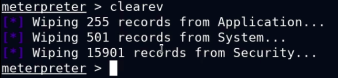

- upload files in C:\Temp
- look for cleanup .rc scripts when uploading payloads
- to run .rc script -
	- resource <path_to_rc> : run in meterpreter session
- clearev (meterpreter command): clear event logs (stay away unless specified)
- Negotiate what you can do: regedit? kernel-exploit?
